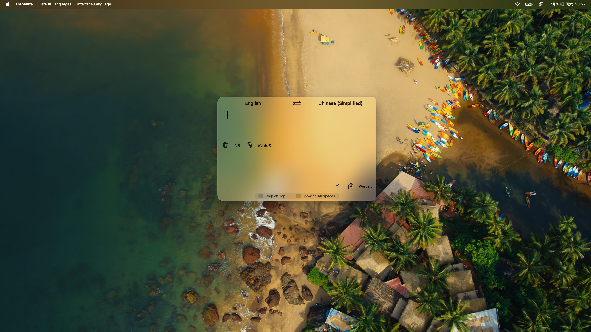

# Translate — lalalaladam

A native macOS translation workspace with a glass interface, multilingual support, long-text handling, Spaces behavior, and configurable shortcuts. This is an independent redesign and extension originally derived from [m-inan/mac-translate](https://github.com/m-inan/mac-translate); it is not an official version and is not endorsed by the original author.

## Current version

The first standalone release is Translate v1.0.0. Releases will be published at [Translate-Mac-lalalaladam](https://github.com/lalalaladam/Translate-Mac-lalalaladam/releases).

The interface includes the native macOS **Translate** (`翻译`), **Default Languages** (`默认语言`), and **Interface Language** (`界面语言`) menus, centered language controls, glass surfaces, and the optional window-behavior bar.

## Features

- Google Translate embedded in a native Cocoa/AppKit window through `WKWebView`.
- Compact two-pane translation interface with selectable source and result text.
- Copy selected text or copy all source/result text from the native Translate menu.
- Configurable global and in-window keyboard shortcuts with duplicate detection and restore-defaults support.
- Native macOS **Translate** (`翻译`), **Default Languages** (`默认语言`), and **Interface Language** (`界面语言`) menus.
- Persistent default source and target languages, with source-only automatic detection.
- 134 language entries in the language menu, subject to Google Translate availability.
- Simplified Chinese and English interface modes, including matching Google Translate locale labels.
- Optional compact-interface controls for pinyin/transliteration, Google selection actions, source/result action buttons, and selected-language highlighting.
- **Clear Source** (`清除原文`), **Speak Source** (`朗读原文`), **Copy Source** (`复制原文`), **Speak Translation** (`朗读译文`), **Copy Translation** (`复制译文`), and **Translation Complete** (`翻译完成`) controls.
- **Copy All Source Text** (`复制全部原文`) and **Copy All Translation** (`复制全部译文`) commands, plus cleanup of unwanted Google controls and overlays.
- Automatic window presentation on launch, connection feedback, retry handling, and manual retry support.
- macOS dark/light appearance-aware native controls.

## Improvements over the original project

Compared with the original [mac-translate](https://github.com/m-inan/mac-translate), this version includes:

- A native Carbon global hotkey implementation with editable **Shortcut Settings…** (`快捷键设置…`) and native speech controls.
- A normal, activatable macOS window instead of a permanently floating panel.
- Independent current-Space **Keep on Top** (`置顶`) and **Show on All Spaces** (`所有 Space 显示`) preferences.
- Support for summoning the window from another application’s full-screen Space on macOS 13 and later.
- Persistent language, interface-language, display, and window-behavior preferences.
- Cold-launch presentation that does not wait for Google Translate or network readiness.
- Safer text selection, copying, dragging, and native menu behavior inside the web view.
- More extensive Google Translate DOM/CSS cleanup, including pinyin, selection toolbars, detail overlays, feedback controls, and extra action buttons.
- Input and result-rendering stability improvements, including coalesced DOM cleanup while typing and prevention of the result-toolbar “G” button flash.

## Download and installation

Download the latest release from the [GitHub Releases page](https://github.com/lalalaladam/Translate-Mac-lalalaladam/releases/latest), unzip it, and move `Translate.app` to `/Applications`.

Because the app is distributed outside the Mac App Store and uses an ad-hoc/local signature, macOS may require approval under **System Settings → Privacy & Security → Open Anyway** the first time it is opened.

## Configuration

The initial default direction is **English** (`英语`) → **Chinese (Simplified)** (`中文（简体）`). Use the native **Default Languages** (`默认语言`) menu to choose a persistent default source and target language. Use **Apply Default Languages** (`应用默认语言`) to return to the saved pair after changing languages within Google Translate, or **Restore English → Chinese (Simplified)** (`恢复为英语 → 中文（简体）`) to restore the initial pair.

The native status-bar menu and in-window controls expose independent window-behavior options:

- **Keep on Top** (`置顶`)
- **Show on All Spaces** (`所有 Space 显示`)

These controls are available from the bottom behavior bar and the macOS status-bar menu.

## Keyboard shortcuts

All shortcuts can be changed from **Translate** (`翻译`) → **Shortcut Settings…** (`快捷键设置…`). The defaults below are read from the current source code and can be restored at any time.

| Default shortcut | Action |
| --- | --- |
| `⌘\\` | Show or hide the window globally (`全局显示或隐藏窗口`) |
| `⌘W` | Close/hide the window without quitting (`关闭/隐藏窗口但不退出应用`) |
| `⌘H` | Hide the application (`隐藏应用`) |
| `⌘Q` | Quit the application (`退出应用`) |
| `⌘A` | Select all source text (`选中全部原文`) |
| `⌘9` | Speak source text (`朗读原文`) |
| `⌘0` | Speak translation (`朗读译文`) |
| `⌘.` | Stop speaking (`停止朗读`) |
| `⇧⌘S` | Swap languages (`交换语言`) |
| `⌘Z` | Undo (`撤销`) |
| `⌘R` | Redo (`重做`) |
| `⌘X` | Cut (`剪切`) |
| `⌘C` | Copy selected text (`复制所选文字`) |
| `⌘V` | Paste (`粘贴`) |

The native **Translate** (`翻译`) menu also provides **Copy All Source Text** (`复制全部原文`) and **Copy All Translation** (`复制全部译文`); these commands do not have default keyboard equivalents.

## Window and Spaces behavior

The translation window opens automatically on a cold launch and can be shown or hidden with the global shortcut or the native Translate menu. Closing the window hides it without terminating the application.

The bottom behavior bar and macOS status-bar menu expose the following independent preferences, disabled by default:

- **Keep on Top in the Current Space** (`当前 Space 置顶`) keeps the window above normal windows in its current Space.
- **Show on All Spaces** (`所有 Space 显示`) makes the window available across Spaces. On macOS 13 and later, it can also be summoned over another application’s full-screen Space (`全屏 Space`).

Blank areas of the interface can be used to drag the window, while text areas retain selection and copying priority.

## Interface and translation language settings

The **Interface Language** (`界面语言`) menu switches between **Simplified Chinese** (`简体中文`) and **English** (`英语`) for native menus and Google Translate’s language labels. The choice is saved across launches. Changing it preserves the current source text and temporary translation direction.

The **Default Languages** (`默认语言`) menu stores the default translation pair independently from temporary changes made inside Google Translate. **Automatic Detection** (`自动检测`) is available only for the source language, and the app avoids saving the same language as both source and target.

## System requirements

- macOS 12.4 or later
- Apple Silicon (`arm64`) release build
- Network access to Google Translate
- A working internet connection, VPN, or system proxy where Google Translate is not directly reachable

This is a native macOS application and is not intended to run on Windows. It is not an offline translation engine; translation depends on Google Translate and its web interface, which may change independently of this project.

## Credits

This project is based on [Mac Translate by m-inan](https://github.com/m-inan/mac-translate). The original author and project are explicitly credited for the starting implementation and concept. This repository is an unofficial independent customization and is not affiliated with or endorsed by Google or m-inan.

## Reporting issues and contributing

Please [open an issue](https://github.com/lalalaladam/Translate-Mac-lalalaladam/issues) with reproduction steps, macOS version, app version, and relevant screenshots or logs. Contributions and focused pull requests are welcome. Changes involving Google Translate selectors should include a clear explanation of the affected interface behavior.
